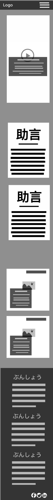

# Nihongo Quest   


Nihongo Quest is a Flask-based web application designed to help users learn Japanese vocabulary through interactive quizzes. Users can log in, take quizzes, and test their knowledge by answering questions about Japanese words.


## Table of Contents
1. [Tech Stack](#tech-stack)
2. [Wireframes](#wireframes)
3. [The Loggo](#the-logo)
4. [Colors](#colors)
5. [Screenshots](#uiux-screenshots)
6. [Nihongo Quest The process](#nihongo-quest---flask--postgresql-setup-guide-example)
7. [Problems & Solutions](#problems-and-solutions)
8. [Algorithm](#example-of-algorithm--code)

### Objective  
The goal of Nihongo Quest is to provide an engaging platform for learning Japanese vocabulary. The app allows users to take quizzes, track their progress, and improve their understanding of the language through repetition and interaction.


# Tech Stack  
# 🛠️

Nihongo Quest is built using a modern and reliable tech stack to ensure a smooth user experience and scalable performance.  

## 🎨 Style  
- **CSS** – Handles the layout and styling, ensuring a visually appealing and responsive design.  
- **Flexbox** & **Grid** – structuring content and creating a consistent layout across different screen sizes.  

## 🌐 Frontend  
- **HTML** – Provides the foundation for the content and structure of the web app.  
- **JavaScript** – Enables interactivity and dynamic content updates.  
- **Event Listeners** – handling user interactions like clicks and keyboard inputs.  

## 🚀 Backend
  - **Python** – The programming language used to build the backend logic.
- **[Flask](https://flask.palletsprojects.com/)** – A lightweight Python framework used for handling requests and serving data to the frontend.  
- **REST API** – Used for fetching and managing data between the frontend and backend.  

## 🗄️ Database  
- **[PostgreSQL](https://www.postgresql.org/)** – A powerful and reliable relational database used for storing user data, flashcards, and quiz results.  
- **[SQLAlchemy](https://www.sqlalchemy.org/)** – An ORM (Object-Relational Mapping) tool used to simplify database interactions.  

## Illustration & Design 
#   🎨
- **[Procreate](https://procreate.com/)** –  Sketch the minimalist cat logo,defining the color palette and refining the design elements and other illustrations.    
- **[Adobe Illustrator](https://www.adobe.com/products/illustrator.html)** –  designing and creating the logo. 
- **[Clipchamp](https://www.clipchamp.com/)** – editing promotional video About.  

## 🔄 Version Control  
- **[Git](https://git-scm.com/)** – tracking code changes and maintaining version control.  
- **[GitHub](https://github.com/)** – hosting and managing the project repository.  


# [Comeback-to-Readme](#nihongo-quest)
---

# WIREFRAMES  
# 📐

Nihongo Quest features several interactive sections, each designed to enhance the learning experience: **Home**, **Alphabet**, **Flashcards**, **Manga**, and **Quiz**. Below are the wireframes for the four main sections:  

## 🏠 Home  

The **Home** section introduces the web app, explaining its purpose and long-term vision. It includes helpful **tips** and insights into Japanese culture and travel, aiming to create an engaging and immersive experience.  

| Desktop View | Tablet View | Mobile View |  
|--------------|-------------|-------------|  
|  |  |  |  

---  

## 🃏 Flashcards  

The **Flashcards** section is designed to improve memory retention through strategic exercises. As mentioned in the **Tips** section, mastering Japanese requires practicing writing, listening, and speaking — future updates will focus on incorporating these objectives.  

| Desktop View | Tablet View | Mobile View |  
|--------------|-------------|-------------|  
|  |  |  |  

---  

## 🔠 Alphabet  

The **Alphabet** section explains the structure and differences between **Hiragana**, **Katakana**, and **Kanji**, providing a clear understanding of how the Japanese writing system works.  

| Desktop View | Tablet View | Mobile View |  
|--------------|-------------|-------------|  
|  |  |  |  

---  

## 📖 Manga Section  

Anime and manga are major gateways to Japanese culture for many learners. The **Manga** section highlights the influence of manga in Western culture and encourages learning Japanese through reading. Users can discover new manga, helping to expand their vocabulary and reading skills in an enjoyable way.  

| Desktop View | Tablet View | Mobile View |  
|--------------|-------------|-------------|  
|  |  |  |  

# [Comeback-to-Readme](#nihongo-quest)
---
# THE LOGO 


The logo for Nihongo Quest features a **minimalist cartoon-style cat head**, symbolizing curiosity and exploration — traits that reflect the learning journey in Nihongo Quest. The cat's simple and clean design represents the Japanese aesthetic of minimalism and balance.  

To the right of the cat's head, the logo includes the Japanese word **"日本語"** (*Nihongo*), which means **"Japanese language."** This reinforces the focus of the app on helping users navigate and learning Japanese through an engaging and intuitive experience.  

The combination of the cat and the Japanese text creates a visually balanced and culturally meaningful symbol that reflects the app’s purpose — learning Japanese through exploration and curiosity.
# [Comeback-to-Readme](#nihongo-quest)
---

# Colors:
## Color Palette Explanation  

The color palette for Nihongo Quest was carefully selected to reflect Japanese culture and history, particularly inspired by **Hiroshima** and the symbolism associated with **Japanese Culture**. Each color has a specific meaning and purpose in the design:  

### **Body Colors**  
| Color | Code | Meaning |  
|-------|------|---------|  
| `#ff4646` | #ff4646 | Represents the red of the Japanese flag, symbolizing the sun and strength. |  
| `#ffffff` | #ffffff | Represents purity and simplicity, inspired by traditional Japanese minimalism. |  
| `#FFBEBE` | #FFBEBE | A light salmon pink, representing warmth and the softness of Japanese cherry blossoms. |  
| `rgb(255, 142, 142)` |rgb(255, 142, 142)| A softer red tone, providing a balanced contrast and warmth. |  
| `linear-gradient(108deg, #ff3314 0%, #86070b 29%, #43031a 75%)` | Gradient | A dynamic red gradient reflecting the intensity and historical depth of Hiroshima. |  

### **Footer and Navbar Colors** 
 

| Color | Code | Meaning |  
|-------|------|---------|  
| `#606060` | #606060 | Neutral gray, symbolizing stability and balance. |  
| `#929292` | #929292 | A lighter gray, providing subtle contrast while maintaining harmony. |  
| `#ffffff` | #ffffff | Ensures readability and clarity. |  
| `#231E1E` | #231E1E | Dark tone for a clean, modern look inspired by traditional Japanese aesthetics. |  

# [Comeback-to-Readme](#nihongo-quest)
---
#  UI/UX Screenshots 
#  🎨

## 🏠 Home  

The **Home** section introduces the Nihongo Quest web app and sets the tone for the learning experience.  

| Desktop View | Tablet View | Mobile View |  
|--------------|-------------|-------------|  
|  |  |  |  

### 🌟 About  
The cover of **Nihongo Quest** introduces the app’s core purpose: to help learners immerse themselves in the Japanese language while experiencing the depth and beauty of Japanese culture.  

### 💡 Tips  
This section explains the key to mastering a new language: **consistent practice**. Listening, speaking, and writing daily is essential — but Nihongo Quest aims to make learning fun and engaging through interactive challenges.  

### 🌍 Travel  
Explore four of the most important cities in Japan — but Nihongo Quest doesn't stop there. The app aims to uncover the hidden secrets and rich history behind Japanese culture.  
**"Learning is more than just knowledge; it’s an adventure."**  

---  

## 🃏 Flashcards  

| Desktop View | Tablet View | Mobile View |  
|--------------|-------------|-------------|  
|  |  |  |  

The **Flashcards** section helps sharpen memory and improve retention through regular exercise.  
> _"Your brain is like a muscle — it needs exercise!"_  
Challenge yourself daily with flashcards to reinforce your learning and track your progress.  

---  

## 📖 Manga Section  

| Desktop View | Tablet View | Mobile View |  
|--------------|-------------|-------------|  
|  |  |  |  

The **Manga** section is a manga search tool where you can explore your favorite titles and suggest new ones.  
Curiosity is key to language learning — discovering new manga can expand your vocabulary and strengthen your reading skills.  
> _"Progress comes from curiosity."_

# [Comeback-to-Readme](#nihongo-quest)

---
## Problems and Solutions  

### ❌ **Problem: CSRF Token Errors in Quiz Form**  
- **Issue:** The CSRF token was missing or not being validated correctly in the form submission.  
- **Solution:**  
  - Ensured that `CSRFProtect(app)` was correctly initialized in `app.py`.  
  - Passed the CSRF token explicitly in `render_template()`.  
  - Added a hidden input field in `quiz.html` to include the CSRF token in the form.  

### ❌ **Problem: Understanding Mako Templates**  
- **What is Mako?**  
  Mako is a templating engine for Python, similar to Jinja2 but with a syntax closer to standard Python expressions.  
  - **Why is it relevant?** Mako is sometimes used in Flask applications when working with certain frameworks or plugins that require an alternative template engine.  
  - **In Nihongo Quest:** We are using Jinja2 (Flask's default template engine), so Mako is not needed for now. However, understanding Mako can be useful for other Python projects.  

## Installation  

1. Clone the repository:  
   ```sh
   git clone https://github.com/your-username/nihongo-quest.git
   cd nihongo-quest
   ```

2. Create and activate a virtual envionment:
   ```sh
   python -m venv venv
   source venv/bin/activate  # On Windows: venv\Scripts\activate

   ```

3. Install independecies:
   ```sh
   pip install -r requirements.txt

   ```
4. Run the application
   ```sh
   flask run

   ```
## Contributing  

Feel free to open issues or submit pull requests to improve Nihongo Quest! 

# [Comeback-to-Readme](#nihongo-quest)

#  Nihongo Quest - Flask & PostgreSQL Setup Guide example
# 📚


## Table of Contents
1. [Data Base](#1-database)
2. [Back-end](#2-backend-flask--sqlalchemy)
3. [Front-end](#3-frontend-html--jinja2-templates)
4. [Comeback-to-Readme](#nihongo-quest)
     
##  1. Database

### 📌 Step 1: Create a Database and Table  
1. Open **pgAdmin 4** and connect to your PostgreSQL server.  
2. Create a new database:  
   - **Right-click** on "Databases" → Click **"Create"** → Select **"Database"**  
   - Enter a **name** (e.g., `nihongo_db`) → Click **Save**  
3. Open the **Query Tool** and create a table:  
   ```sql
   CREATE TABLE hiragana (
       id SERIAL PRIMARY KEY,
       character VARCHAR(10) NOT NULL,
       pronunciation VARCHAR(20) NOT NULL
   );
   ```  
4. Insert sample data:  
   ```sql
   INSERT INTO hiragana (character, pronunciation) VALUES
   ('あ', 'a'), ('い', 'i'), ('う', 'u'), ('え', 'e'), ('お', 'o');
   ```

### 🌍 API Endpoints

| Endpoint      | Method | Description          |
|--------------|--------|----------------------|
| /            | GET    | Home Page            |
| /quiz        | GET    | Quiz Section         |
| /flashcards  | GET    | Flashcards Page      |
| /alphabet    | GET    | Alphabet Learning    |
| /manga       | GET    | Manga Section        |
| /register    | POST   | User Registration    |
| /login       | POST   | User Login           |


### 🗄️ Database Structure

- **Users Table**: Stores user details  
- **Flashcards Table**: Stores flashcards content  
- **Manga Table**: Stores manga references  
- **Quiz Table**: Stores quiz questions & answers  


---

##  2. Backend (Flask + SQLAlchemy)  

### 📌 Step 2: Install Dependencies  
Run the following command inside your virtual environment:  
```bash
pip install flask flask-sqlalchemy psycopg2
```

### 📌 Step 3: Database Configuration  
#### 📂 `db.py` (Database Connection)  
```python
from flask_sqlalchemy import SQLAlchemy

db = SQLAlchemy()
```

#### 📂 `config.py` (Database Settings)  
```python
import os

DB_NAME = "nihongo_db"
DB_USER = "postgres"
DB_PASSWORD = "password"
DB_HOST = "localhost"
DB_PORT = "5432"

DATABASE_URI = f"postgresql://{DB_USER}:{DB_PASSWORD}@{DB_HOST}:{DB_PORT}/{DB_NAME}"
```

---

### 📌 Step 4: Define Models  
#### 📂 `models/alphabet.py` (Hiragana Model)  
```python
from db import db

class Hiragana(db.Model):
    __tablename__ = "hiragana"
    id = db.Column(db.Integer, primary_key=True)
    character = db.Column(db.String(10), nullable=False)
    pronunciation = db.Column(db.String(20), nullable=False)
```

---

### 📌 Step 5: Create Flask Routes  
#### 📂 `routes/alphabet_routes.py` (Blueprint & API Routes)  
```python
from flask import Blueprint, render_template
from db import db
from models.alphabet import Hiragana

alphabet_bp = Blueprint("alphabet", __name__, url_prefix="/alphabet")

@alphabet_bp.route('/hiragana')
def get_hiragana():
    characters = Hiragana.query.all()
    return render_template('alphabet/hiragana.html', characters=characters)
```

---

### 📌 Step 6: Initialize Flask App & Register Blueprints  
#### 📂 `app.py` (Main Application File)  
```python
from flask import Flask
from config import DATABASE_URI
from db import db
from routes.alphabet_routes import alphabet_bp

app = Flask(__name__)
app.config['SQLALCHEMY_DATABASE_URI'] = DATABASE_URI
app.config['SQLALCHEMY_TRACK_MODIFICATIONS'] = False

db.init_app(app)
app.register_blueprint(alphabet_bp)

if __name__ == '__main__':
    with app.app_context():
        db.create_all()  # Create tables if they don't exist
    app.run(debug=True)
```

---

##  3. Frontend (HTML + Jinja2 Templates)  

### 📌 Step 7: Create the Template  
#### 📂 `templates/alphabet/hiragana.html` (Frontend Display)  
```html
<!DOCTYPE html>
<html lang="en">
<head>
    <meta charset="UTF-8">
    <meta name="viewport" content="width=device-width, initial-scale=1.0">
    <title>Hiragana Characters</title>
</head>
<body>
    <h1>Hiragana Alphabet</h1>
    <table border="1">
        <tr>
            <th>Character</th>
            <th>Pronunciation</th>
        </tr>
        
        <tr>
            <td>{{ char.character }}</td>
            <td>{{ char.pronunciation }}</td>
        </tr>
        
    </table>
</body>
</html>
```

---
##  4. Run the Flask App  
1. Open the terminal and activate your virtual environment.  
2. Start the Flask app:  
   ```bash
   flask run
   ```
3. Open your browser and visit:  
   **`http://127.0.0.1:5000/alphabet/hiragana`**  

# [Comeback-to-Readme](#nihongo-quest)

---
##  Next Steps
# 🚀

- 1. **Update Route**: Add routes to update user data or entries (e.g., update user profile, update word details).

- 2. **Delete Route:** Implement delete functionality for users, words, or other records.

- 3. **Testing** & bug fixing

- 4.  Deploy to **Heroku**

---
# EXAMPLE OF ALGORITHM & CODE:

## 📌 Quiz Function Explanation
The `quiz()` function handles the quiz logic in a Flask web application. It:

- Displays a form with words from the database.
- Processes user answers and checks correctness.
- Uses Flask routes, loops, if-else conditions, dictionaries, and flash messages.
- Requires user authentication `(@login_required)`.
- Redirects users after submission.

## 📌 Code analysis of word.py:

Flask and PostgreSQL.
```python
# 1. Importing Dependencies: "word.py"  
from flask import current_app
from extensions import db

class Word(db.Model):  #  2. Defining the `Word` Model: "Defines a SQLAlchemy model for a database table"
   
    #  3. Defining Database Columns:
    id = db.Column(db.Integer, primary_key=True)  # Unique ID for each word (Primary Key)
    japanese = db.Column(db.String(100), nullable=False)  # Japanese word (max 100 chars)
    english = db.Column(db.String(100), nullable=False)  # English translation (max 100 chars)

    def __repr__(self):
        return f"<Word {self.japanese} - {self.english}>"  # String representation for debugging

```

## 🔍 Code with Detailed Comments

```python
# Function: Defines a route for the quiz page
@app.route("/quiz", methods=["GET", "POST"])  # Flask route decorator
@login_required  # Restricts access to logged-in users
def quiz():  # Function definition
    words = Word.query.all()  # Query database (Array/List of objects)
    feedback = {}  # Dictionary to store feedback

    # If-Else Condition: Checks if the request method is POST (Form submitted)
    if request.method == "POST":
        answers = {}  # Dictionary to store user's answers
        correct_answers = 0  # Counter for correct answers
        total_questions = 0  # Counter for total questions

        # For Loop: Iterates over each word in the database
        for word in Word.query.all():
            answer_key = f"answer_{word.id}"  # Generates form key dynamically
            user_answer = request.form.get(answer_key, "").strip()  # Gets user input
            correct_answer = word.english.strip()  # Fetches correct answer

            # If Condition: Compares user input with the correct answer (Case insensitive)
            if user_answer.lower() == correct_answer.lower():
                correct_answers += 1  # Increments correct answer count

            total_questions += 1  # Increments total question count
            answers[word.id] = user_answer  # Stores user's answer in dictionary

        # If-Else Condition: Provides feedback based on quiz performance
        if correct_answers == total_questions:
            flash("Perfect score! All answers are correct. 🎉", "success")  # Success message
        elif correct_answers > 0:
            flash(f"{correct_answers} correct answers. Keep practicing!💪", "warning")  # Encouragement
        else:
            flash("No correct answers. Keep practicing! 💪", "danger")  # Motivational message

        return redirect(url_for("index"))  # Redirects to homepage after submission

    # Else If Condition: Handles GET request (Displays quiz form)
    elif request.method == "GET":
        words = Word.query.all()  # Fetches all words from database

    return render_template("quiz.html", words=words)  # Renders quiz page
```
## 📌 Explanation with W3Schools References

| Concept                              | Explanation                                                                | W3Schools, flask, and SQLAlquemy Links       |
|--------------------------------------|----------------------------------------------------------------------------|----------------------|
| **Function (`def`)**                 | Defines a function (`quiz()`) to handle requests.                          | [Python Functions](https://www.w3schools.com/python/python_functions.asp) |
| **Flask Route (`@app.route`)**       | Defines a route (`/quiz`) that handles GET and POST requests.              | [Flask Routes](https://flask.palletsprojects.com/en/2.3.x/quickstart/#routing) |
| **If-Else (`if request.method == "POST"`)** | Checks whether the request is a form submission (POST) or just loading the page (GET). | [Python If-Else](https://www.w3schools.com/python/python_conditions.asp) |
| **Loop (`for word in Word.query.all()`)** | Iterates over each word stored in the database.                            | [Python Loops](https://www.w3schools.com/python/python_for_loops.asp) |
| **Dictionary (`answers = {}`)**      | Stores user answers using key-value pairs.                                 | [Python Dictionaries](https://www.w3schools.com/python/python_dictionaries.asp) |
| **Flask Flash Messages (`flash()`)** | Displays messages to users based on their score.                           | [Flask Flash Messages](https://flask.palletsprojects.com/en/2.3.x/patterns/flashing/) |
| **Flask Redirect (`redirect(url_for("index"))`)** | Redirects users to another route.                                    | [Flask Redirect](https://flask.palletsprojects.com/en/2.3.x/api/#flask.redirect) |
| **Class (`class Word`)**             | Defines a database model (`Word`) with attributes `id`, `japanese`, and `english`. | [Python Classes](https://www.w3schools.com/python/python_classes.asp) |
| **SQLAlchemy Model (`db.Model`)**    | Connects the `Word` class to the PostgreSQL database using SQLAlchemy.     | [SQLAlchemy Models](https://flask-sqlalchemy.palletsprojects.com/en/3.0.x/models/) |
| **Database Column (`db.Column`)**    | Defines table columns (`id`, `japanese`, `english`) in the database.       | [SQLAlchemy Column](https://flask-sqlalchemy.palletsprojects.com/en/3.0.x/models/#column) |
| **String Data Type (`db.String`)**   | Stores text data with a max length (e.g., `100` characters).               | [SQLAlchemy String](https://docs.sqlalchemy.org/en/20/core/type_basics.html#sqlalchemy.types.String) |
| **Primary Key (`primary_key=True`)** | Uniquely identifies each word entry in the database.                       | [Primary Key](https://www.w3schools.com/sql/sql_primarykey.asp) |
| **Special Method (`__repr__`)**      | Returns a string representation of the object (`"<Word Japanese - English>"`). | [Python __repr__](https://www.w3schools.com/python/ref_func_repr.asp) |


## ✅ Summary algorithm
- This function is responsible for handling quiz logic in the Flask app.
- Uses database queries to fetch words from the database.
- Uses a for loop to iterate through words and compare answers.
- Implements flash messages to give users feedback.
- Uses redirect() to send users back to the homepage after submission.
📌 For more information, check the W3Schools and Flask links above! 🚀

quiz.html end explanation:
```html
<!-- 1. Page Header: "Displays the title of the quiz page" -->
<h1>Japanese Quiz</h1>

<!-- 2. Form Setup: "Defines a form that submits data to the '/quiz' route via POST" -->
<form action="{{ url_for('quiz')}}" method="POST">

    <!-- 3. CSRF Token: "Prevents CSRF attacks for security" -->
    <input type="hidden" name="csrf_token" value="{{ csrf_token() }}">

    <!-- 4. Looping Through Words: "Displays each Japanese word and an input box for the answer" -->
    
       <p>What is the meaning of "{{ word.japanese }}"?</p>
       <input type="text" name="answer_{{ word.id }}" 
       class="correctincorrect">
    

    <!-- 5. Submit Button: "Sends the user's answers for evaluation" -->
    <button type="submit">Submit</button>
</form>

<!-- 6. Return Link: "Navigates back to the homepage" -->
<a href="/">Return to Home</a>

```
# [Comeback-to-Readme](#nihongo-quest)
---


